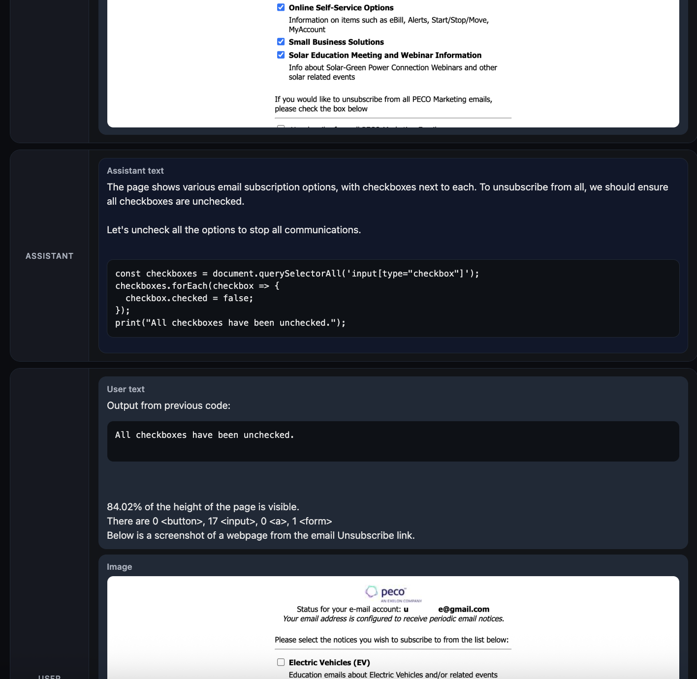

# unsub

This is an experimental project at using AI agents to unsubscribe from spam emails.
The system works by first using text-based models to find unsubscribe links in spam emails, and then
using a vision model to drive a web browser to navigate the unsubscribe page.

Here's a snippet of a chat where the program gives a screenshot of a page to the agent, and the agent
runs JavaScript code to uncheck the checkboxes on a webpage.



# Usage

## Installation

Install using pip or uv

```
pip install -e .
```

or

```
uv pip install -e .
```

You will need an OpenAI developer account; make sure your `OPENAI_API_KEY` environment variable is set.

## Extracting unsubscribe links from emails

To allow these scripts to access Gmail, you will have to create a project on the [Google Developer Console](https://console.cloud.google.com/). Create a project and get its project ID, then get a client ID and a client secret. You should put them in the environment variables `GOOGLE_CLIENT_ID`, `GOOGLE_CLIENT_SECRET`, and `GOOGLE_PROJECT_ID`. Add the URL `http://localhost:1337/` as an authorized redirect URI.

Once you are setup, you should be able to run

```
python -m unsub.cmd.list_unsub_links
```

The first time you run this, it will ask you to authenticate in your browser. It will then dump email metadata into a directory called `emails/`. You can change this location by passing `--output-dir`.

## Running an agent

To run an unsubscribe agent on all of your dumped emails, you can do


```
python -m unsub.cmd.run_agent_many \
    --user_email 'YOUR_EMAIL_ADDRESS' \
    --log_path ./unsub_logs \
    --email_dir emails \
    --headless
```

The `--headless` flag prevents a browser from visibly popping up on your machine. If you omit it, you can watch unsubscribe pages be accessed. You can also pass `--verbose` to see more details on what the agent is doing.

Detailed logs will be written to the `unsub_logs` directory, or whatever you pass to `--log_path`.

## Viewing logs

The agent will spit out a full chat transcript between itself and the AI model. The files are saved as domain names with a `.json` extension. You can view this as a nice HTML page like so:

```
python -m unsub.cmd.view_chat unsub_logs/link.p.email.roku.com.json
```

This will write an HTML page and also open it in your browser (if possible).
